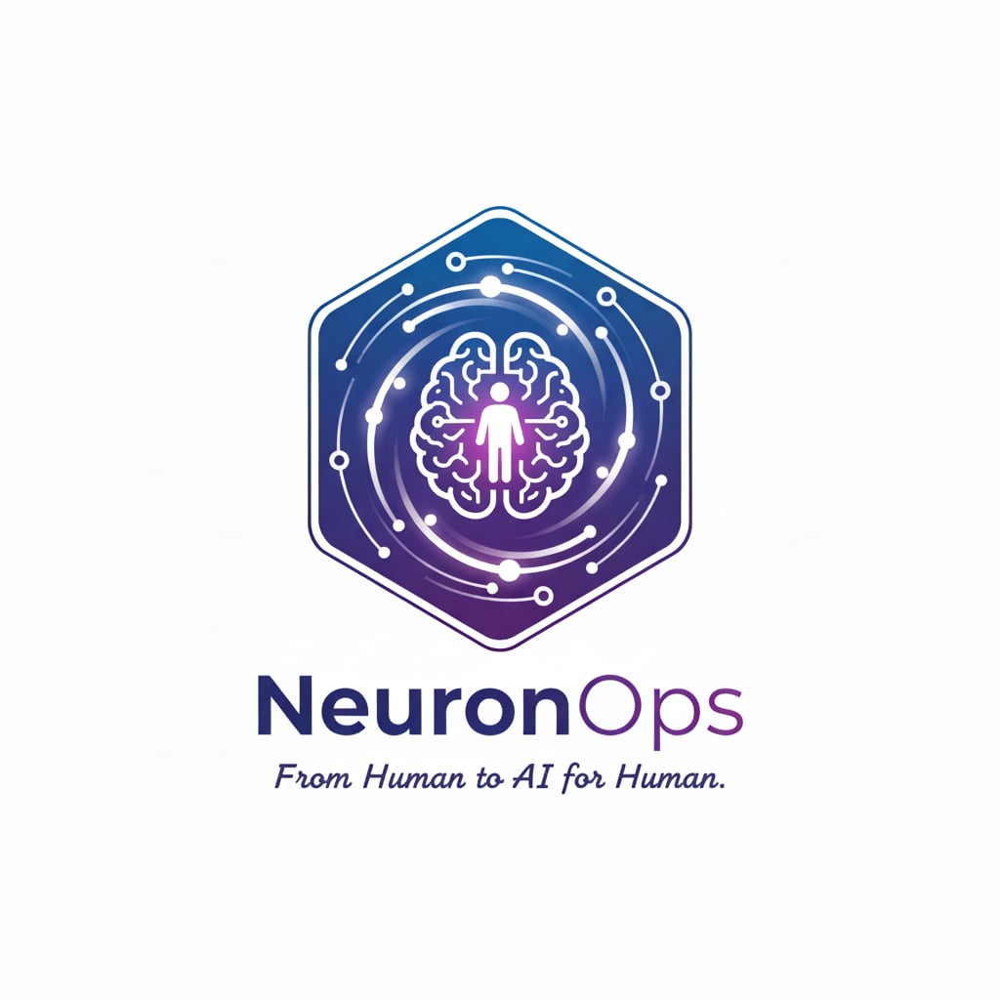

<h1>NeuronOps</h1>

<h4>Enterprise Artificial Intelligence & Intelligent Systems</h4>

Transforming businesses with human-centered artificial intelligence solutions that are scalable, secure, and sustainable.

## Who We Are

**NeuronOps** is an AI consulting firm specialized in designing, deploying, and scaling AI systems for enterprises that demand reliability, transparency, and real-world impact.

We partner with C-level executives, CTOs, and innovation leaders who seek mature AI strategies, not experimental prototypes.

Our work is enterprise-grade, production-first, and built for systems that operate at scale with governance, security, and accountability.

> [!TIP]
> NeuronOps helps organizations adopt AI with confidence through practical, scalable, and responsible implementation strategies.

## Our Mission

We exist to enable organizations to harness AI responsibly and effectively.

We believe artificial intelligence should:

- Augment human capability
- Respect ethical boundaries
- Deliver measurable business value
- Operate transparently and securely

Our mission is to make AI trustworthy, explainable, and aligned with real business needs, not hype cycles.

## Our Services

Production-first AI solutions tailored to enterprise environments and operational constraints.

### AI Strategy & Consulting

We assess your AI maturity, audit existing systems, and deliver strategic roadmaps aligned with business objectives.

Our recommendations prioritize:

- Feasibility
- ROI
- Long-term scalability
- Operational sustainability

#### Capabilities

- AI maturity assessments
- Technology & architecture audits
- Strategic roadmaps and transformation planning
- Executive AI advisory

### Business & Process Analysis

We analyze workflows and operational systems to identify high-value AI opportunities with measurable impact.

Our approach combines business intelligence with technical feasibility to ensure investments generate sustainable returns.

#### Capabilities

- Workflow and operations analysis
- AI opportunity identification
- ROI and feasibility assessment
- Process optimization strategies

### AI Automation & Intelligent Agents

We design and deploy intelligent agents that streamline enterprise operations.

From customer support automation to internal AI assistants, our systems improve productivity while maintaining governance and reliability.

#### Capabilities

- Conversational AI and chatbots
- Internal enterprise assistants
- CRM, HR, and operations agents
- Knowledge management systems
- Workflow automation

### CRM / ERP & AI Integration

We integrate AI capabilities into existing enterprise platforms, ERP systems, CRMs, and custom software architectures.

Our integrations are secure, scalable, and designed for production environments.

#### Capabilities

- Enterprise system integration
- Legacy modernization
- AI enablement for existing platforms
- Scalable cloud-native architectures
- API and infrastructure integration

### AI Model Development

We develop production-grade AI systems tailored to enterprise use cases.

Our solutions include predictive analytics, NLP systems, computer vision pipelines, and recommendation engines with monitoring and lifecycle management.

#### Capabilities

- Predictive analytics and forecasting
- Natural language processing (NLP)
- Computer vision systems
- Classification and recommendation engines
- MLOps and model monitoring
- Continuous model improvement

### Ethics, Compliance & AI Governance

We establish governance frameworks that ensure compliance with privacy regulations, AI laws, and industry standards.

Our governance-first methodology prioritizes transparency, accountability, cybersecurity, and risk mitigation.

#### Capabilities

- AI governance frameworks
- Regulatory compliance (GDPR, AI Act, Loi 25)
- Risk assessment and mitigation
- Data protection & cybersecurity practices
- Explainability and transparency standards
- Responsible AI policies

## Enterprise AI Philosophy

NeuronOps solutions are designed with enterprise resilience and operational excellence in mind.

### Our Core Principles

- Human-Centered AI
- Security & Compliance
- Explainable Systems
- Scalable Architectures
- Production-First Engineering
- Long-Term Maintainability
- Governance & Accountability

We believe successful AI adoption requires more than models — it requires operational maturity, trust, and alignment with organizational goals.

## Why Organizations Choose NeuronOps

Organizations partner with NeuronOps because we focus on:

- Business outcomes over experimentation
- Secure and maintainable architectures
- Strategic alignment with enterprise goals
- Transparent and explainable AI systems
- Sustainable long-term AI adoption

> [!NOTE]
> We prioritize practical AI systems that integrate seamlessly into real operational environments.

## Industries We Support

NeuronOps solutions can be adapted across multiple industries, including:

- Finance & Banking
- Healthcare
- Retail & E-Commerce
- Manufacturing
- Logistics & Supply Chain
- Telecommunications
- Government & Public Sector
- SaaS & Technology Companies

## Collaboration Approach

We work closely with leadership teams, technical departments, and operational stakeholders to ensure successful AI transformation initiatives.

Our engagements typically include:

1. Discovery & Assessment
2. Strategy & Planning
3. Architecture & Integration
4. Deployment & Scaling
5. Governance & Optimization

## Contact

**NeuronOps**
Enterprise AI Consulting & Intelligent Systems

- Website: [neuron-ops](https://neuron-ops.vercel.app)
- Email: <zouariomar20@gmail.com>

## Vision

Our vision is to help organizations build AI ecosystems that are trustworthy, scalable, and aligned with human values.

We believe the future of AI belongs to organizations that combine innovation with responsibility.

> NeuronOps - Responsible AI Built for Enterprise Scale
